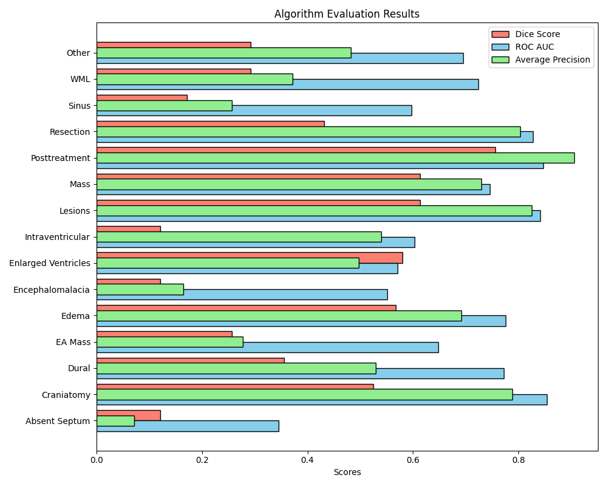
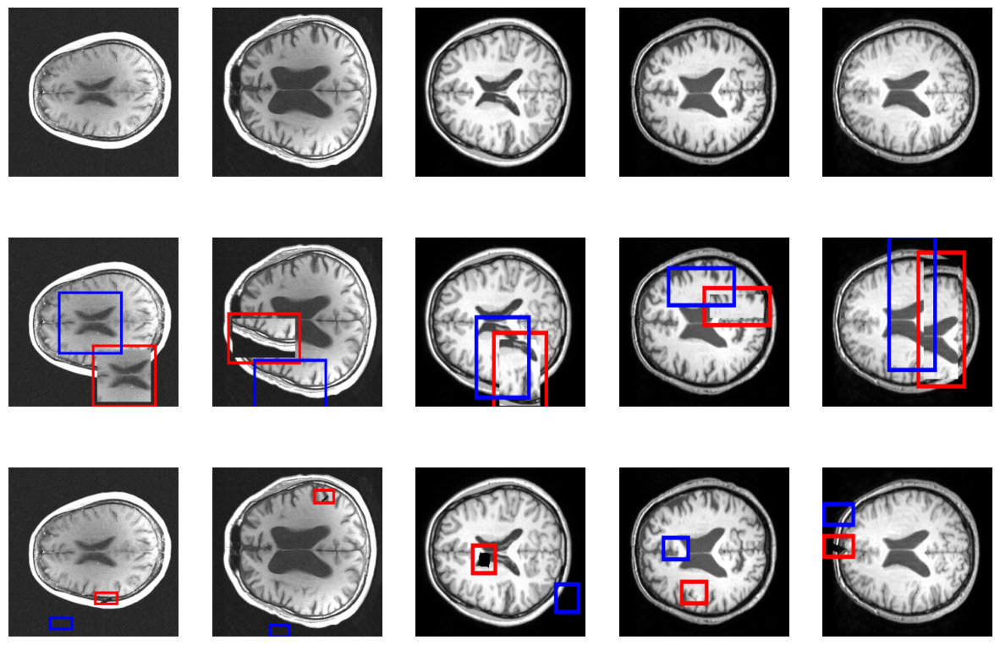
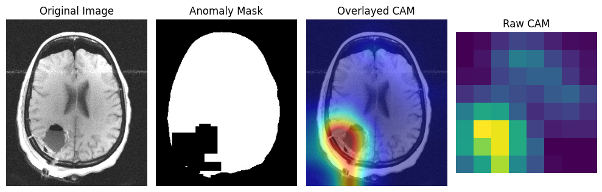
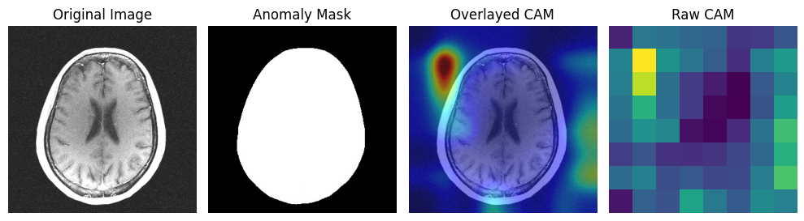

# UADMI Seminar Project - CutPaste Implementation

This project is the implementation of ["CutPaste: Self-Supervised Learning for Anomaly Detection and Localization" ](https://arxiv.org/abs/2104.04015) for the detection of brain anomalies within the scope of the Master-Seminar: Unsupervised Anomaly Detection in Medical Imaging (IN2107, IN45010) seminar course.

## Project Setup

First, you have to initialize the environment

> **Note**
> Using a virtual environment would be better

```bash
pip install -r requirements.txt
```

Download and extract the data

> **Note**
> Ensure that the data folder is located in the same directory as the project and is configured appropriately according to the [model.yaml](configs/model.yaml) configuration file.

```bash
wget <link of the data>
unzip data.zip
```

## Dataset

This project utilizes two distinct datasets for training.

1. **fastMRI Dataset**
   - Source: [fastMRI](https://fastmri.med.nyu.edu/)
   - Description: The fastMRI dataset comprises MRI images that have been collected using accelerated MRI techniques, allowing for faster acquisition times.
   - Number of Images: 130
   
2. **IXI Dataset**
   - Source: [IXI Dataset](https://brain-development.org/ixi-dataset/)
   - Description: The IXI dataset consists of brain MRI images collected from the IXI project, providing a diverse set of images for analysis and processing.
   - Number of Images: 581

## Results

The tests were conducted based on the parameters outlined in the table below.

| **Epoch Count** | **Batch Size** | **Learning Rate** | **Momentum** | **Input Size** | **Weight Decay** | **Algorithm**  |
| --------------- | -------------- | ----------------- | ------------ | -------------- | ---------------- | -------------- |
| 256             | 96             | 0.03              | 0.9          | 256x256        | 0.00003          | 3-Way CutPaste |



Comprehensive ROC Curve figures and detailed results for each pathology are available in the [results folder](results/).

### CutPaste Augmentation



### Prediction with Overlayed GradCAM




